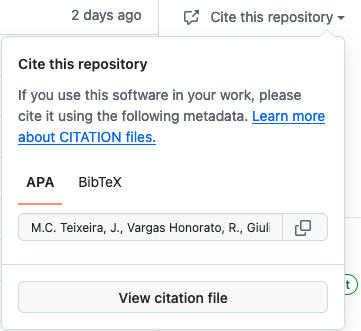

# How to cite haddock3

## Citing haddock3

Here is the list of research articles related to haddock3:

- **Description of haddock3**: Marco Giulini#, Victor Reys#, Joao M. C. Teixeira#, Brian Jimenez-Garcia#, Rodrigo V. Honorato#, Anna Kravchenko, Xiaotong Xu, Raphaelle Versini, Anna Engel, Stefan Verhoeven, Alexandre M.J.J. Bonvin, [HADDOCK3: A modular and versatile platform for integrative modelling of biomolecular complexes](https://www.biorxiv.org/content/10.1101/2025.04.30.651432v1) [BioRxiv](https://www.biorxiv.org/content/10.1101/2025.04.30.651432v1)
- **Haddock3 web-application**: (soon!)
- **Benchmarks**:
  - Focused Antibody-Antigen docking: M. Giulini, C. Schneider, D. Cutting, N. Desai, C. Deane and **A.M.J.J. Bonvin**. [Towards the accurate modelling of antibody-antigen complexes from sequence using machine learning and information-driven docking](https://doi.org/10.1093/bioinformatics/btae583). _Bioinformatics_ *40*:btae583, p. 1-11 (2024). [BioRxiv](https://www.biorxiv.org/content/10.1101/2023.11.17.567543v1)
  - Glycan docking: A. Ranaudo, M. Giulini, A. Pelissou Ayuso and **A.M.J.J. Bonvin**. [Modelling Protein-Glycan Interactions with HADDOCK](https://doi.org/10.1021/acs.jcim.4c01372). _J. Chem. Inf. Mod._ *64*, 7816–7825 (2024).

## Citing haddock3 source-code

The haddock3 source code can be cited, as the GitHub repository contains a CITATION.cff file.
For this, go to [https://github.com/haddocking/haddock3](https://github.com/haddocking/haddock3) and click on the `Cite this repository` on the right (see image).

<figure align="center">
  
</figure>
