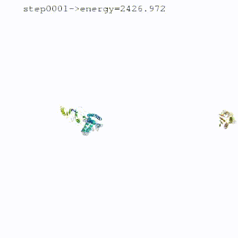

# Sampling modules

- [`[rigidbody]` module](#rigidbody-module)
- [`[lightdock]` module](#lightdock-module)
- [`[gdock]` module](#gdock-module)

## `[rigidbody]` module

The `[rigidbody]` module does a **randomization of orientations and rigid-body minimization.**
It corresponds to the classical `it0` step in the HADDOCK2.x series.

In this module, the interacting partners are treated as rigid bodies, meaning that all geometrical parameters such as bond lengths, bond angles, and dihedral angles are frozen.
The partners are first separated in space and randomly rotated around their respective centers of mass. This is controlled by two parameters which, by default, are true: `separate` for separating the molecules and `randrot` for the random rotations about the center of mass.
Afterward, the molecules are brought together by rigid-body energy minimisation with rotations and translation as the only degrees of freedom.

The driving force for this energy minimization is the energy function, which consists of the intermolecular van der Waals and electrostatic energy terms and the restraints defined to guide the docking.
The restraints are distance-based and can consist of unambiguous or ambiguous interactions restraints (AIRS).
In _ab-initio_ docking mode those restraints can be automatically defined in various ways; e.g. between the center of masses ([CM restraints](../abinitio_docking.md#center-of-mass-restraints)) or between randomly
selected patches on the surface (random AIRs).

The definition of those restraints is particularly important as they effectively guide the minimization process.
For example, with a stringent set of AIRs or unambiguous distance restraints, the solutions of the minimization will converge much better and the sampling can be limited.
In _ab-initio_ mode, however, very diverse solutions will be obtained and the sampling should be increased to make sure to sample enough the possible interaction space.

<details >
<summary style="bold">
<b><i>See animation of the rigidbody protocol:</i></b>
</summary>
<figure align="center">
  
</figure>
</details>
<br>

The default HADDOCK scoring function in the rigid-body module is the following:


For a detailed explanation of the components of the scoring function, please have a look [here](../haddocking.md#haddock-scoring-function).

Throughout the years, the weights of the scoring function have been optimized for various systems.
For example, when dealing with small molecules or glycans, it is recommended to scale up the van der Waals term from 0.1 to 1:

```toml
# ...
[rigidbody]
w_vdw = 1.0
# ...
```


Please refer to the [different docking scenarios](../docking_scenarios.md) for more information about how to tune the scoring function for your specific system.

### Notable parameters

The most important parameters for the `[rigidbody]` module are:

- `ambig_fname`: file containing the ambiguous interaction restraints (AIRs)
- `unambig_fname`: file containing the unambiguous interaction restraints
- `randremoval`: whether or not to activate the random removal of restraints (default: True)
- `cmrest`: whether or not to use center of mass restraints (default: False)
- `sampling`: number of rigid body models to generate (default: 1000)

More information about `[rigidbody]` parameters can be accessed [here](https://www.bonvinlab.org/haddock3/src/modules/sampling/haddock.modules.sampling.rigidbody.html#default-parameters) or retrieved by running:

```bash
haddock3-cfg -m rigidbody
```

Here an example configuration file snapshot of a typical execution of the
`[rigidbody]` module:

```toml
# ...
molecules = [
 "1abc.pdb",
 "2xyz.pdb"
]

[topoaa]
[rigidbody]
ambig_fname = "ambig.tbl"
unambig_fname = "unambig.tbl"
sampling = 2000 # higher sampling if information is limited
[caprieval]
# ...
```

<hr>

## `[lightdock]` module

<hr>

## `[gdock]` module

The `[gdock]` module is a **third-party, genetic algorithm-based rigid-body docking engine**, an alternative to `[rigidbody]` for the initial sampling stage.
It is written in Rust and exposed to HADDOCK3 through thin Python bindings (`gdock-py`), shipped as a required dependency, so no separate installation step is needed to use it.

Like `[rigidbody]`, `[gdock]` treats the interacting partners as rigid bodies and accepts the same `ambig_fname` ambiguous interaction restraints (AIRs) file, converting it internally into residue-pair restraints (including support for the `OR` logic used in HADDOCK TBL files).
It also handles ensembles the same way, respecting the `crossdock` setting to dock all receptor-ligand combinations or pair models by index.

Internally, each candidate docking pose is encoded as a chromosome of 6 genes: 3 Euler rotation angles and 3 translation values placing the ligand relative to the receptor.
A population of these poses is evolved over generations using tournament selection, uniform crossover, Gaussian ("creep") mutation for local refinement, and elitism, with early stopping once the population converges.
Each pose is scored with a physics-based energy function combining van der Waals, electrostatics, desolvation, and a flat-bottom harmonic AIR restraint term modeled after HADDOCK's own ambiguous restraints.

On the Protein-Protein Docking Benchmark v5, `[gdock]` reaches a 95.9% success rate (DockQ ≥ 0.23) with typical runs completing in a matter of seconds. For a full description of the algorithm, scoring function, and benchmarks, see [gdock.org](https://gdock.org).

### Notable parameters

The most important parameters for the `[gdock]` module are:

- `ambig_fname`: file containing the ambiguous interaction restraints (AIRs), converted to residue pairs for `gdock`
- `max_generations`: maximum number of genetic algorithm generations (default: 250)
- `number_of_individuals`: genetic algorithm population size (default: 150)
- `sampling`: maximum number of unique models collected per input pair, i.e. the Hall-of-Fame capacity (default: 1000)
- `seed`: random seed, for reproducibility (default: 42)
- `crossdock`: whether to dock all receptor x ligand combinations of the input ensembles (default: True)

More information about `[gdock]` parameters can be accessed [here](https://www.bonvinlab.org/haddock3/modules/src/sampling/haddock.modules.sampling.gdock.html#default-parameters) or retrieved by running:

```bash
haddock3-cfg -m gdock
```

Here an example configuration file snapshot of a typical execution of the
`[gdock]` module, used as a drop-in replacement for `[rigidbody]`:

```toml
# ...
molecules = [
 "e2aP_1F3G.pdb",
 "hpr_ensemble.pdb"
]

[topoaa]
[gdock]
ambig_fname = "e2a-hpr_air.tbl"
sampling = 1000
[caprieval]
# ...
```

<hr>
